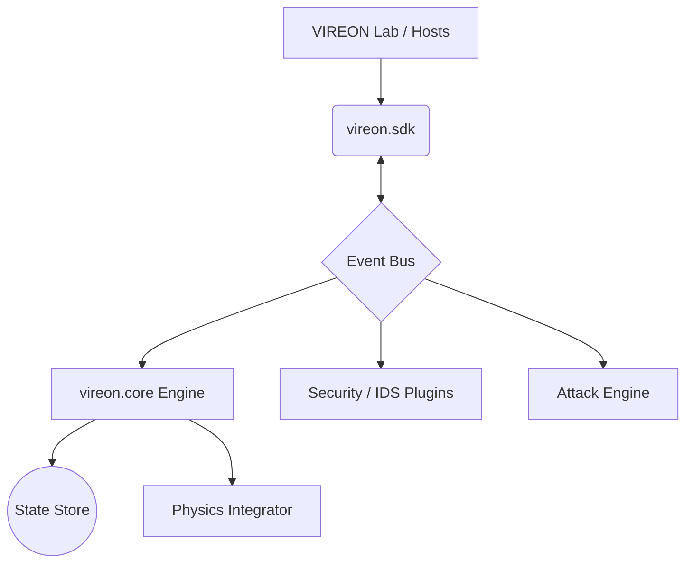

# VIREON: Virtual Laboratory for BCI Security

> [!CAUTION]
> **Research/Education Testbed**
> VIREON is a research and educational platform. While it implements physically consistent ODEs, it is **not** for clinical, diagnostic, or production medical use. Note that while real cryptographic algorithms are utilized, their implementations contain intentional flaws for educational threat modeling and are not cryptographically secure.

[](https://github.com/SaadiMalik1/Vireon/actions/workflows/ci.yml)
[](https://www.python.org/downloads/)
[](https://opensource.org/licenses/Apache-2.0)
[](https://github.com/psf/black)

**Audience**: Security Researchers, Academic Researchers, Developers

## What is VIREON?
VIREON is an open-source research platform for simulating, validating, and evaluating the security of implantable neurotechnology.

It provides a complete **cyber-physical kill chain evaluator** that allows researchers to model the entire attacker lifecycle—from reconnaissance and initial access to physical signal manipulation—across different neurotechnology ecosystems (DBS, VNS, Cochlear, BCI).

## Architectural Split: Framework vs. Lab
VIREON is explicitly divided into two strictly isolated domains:
1. **`VIREON Framework` (`vireon.core`, `vireon.sdk`)**: The deeply isolated simulation engine, deterministic state store, and physics integrators. Third-party vendors interact strictly via the `vireon.sdk` interfaces.
2. **`VIREON Lab` (`vireon_lab`)**: The educational host and consumer of the framework. It contains the interactive web dashboard, tutorials, Capture-The-Flag scenarios, and educational emulators (like OpenBCI).

## Component Status Matrix
| Component | Domain | Status | Description |
|-----------|--------|--------|-------------|
| **Core Runtime Engine** | `VIREON Framework` | **Working** | Event-driven Orchestrator, State Store, and Physics Engine. |
| **Provider SDK** | `VIREON Framework` | **Working** | Frozen `vireon.sdk` interfaces for vendor interoperability. |
| **OpenBCI Cyton Emulator** | `VIREON Lab` | **Working** | Educational plugin emulator with accurate framing. |
| **QEMU HIL Emulator** | `VIREON Lab` | **Working** | Runs real ARM cortex-m firmware images bridged to the platform. |
| **Web Dashboard** | `VIREON Lab` | **Working** | Streamlit UI telemetry and reports dashboard. |
| **Cryptography** | `VIREON Framework` | **Vulnerable** | Uses real algorithms (ECDH, SHA256, AES-GCM) with intentional implementation flaws (e.g., zero-salt HKDF) for threat modeling; NOT secure. |
| **Capture-The-Flag** | `VIREON Lab` | **Working** | Built-in interactive neurosecurity challenges. |

## Who Should Use It?
- **Academic Researchers**: To model the physiological impact of adversarial stimuli without human subjects.
- **Security Researchers**: To develop and validate Intrusion Detection Systems (IDS) and Zero-Trust Architectures (ZTA) for medical implants.
- **Medical Device Engineers**: To test bounded execution, battery constraints, and anti-rollback safeguards on simulated firmware.

## Scientific Disclaimer
> [!WARNING]
> **Not Clinically Validated**: While the physical and physiological equations modeled by VIREON utilize accepted literature models (e.g., Pennes Bioheat, Kuramoto, OCV battery curves), they are approximations built for cybersecurity threat modeling. They have **not** been validated against in-vivo human data and must not be used to make medical decisions.

---

## System Architecture

VIREON's architecture enforces strict Dependency Inversion. All third-party plugins (including `VIREON Lab` emulators) interact through the public `vireon.sdk`.



## Installation & Prerequisites

It is highly recommended to use a virtual environment. The project requires **Python 3.10+** and the **Rust nightly toolchain (1.85+)**.

```bash
git clone https://github.com/SaadiMalik1/Vireon.git
cd Vireon
python3 -m venv .venv
source .venv/bin/activate

# Install the project and all optional dependencies (including UI and Docs)
pip install -e ".[all]"
```

---

## Quick Start & CLI Workflow

VIREON provides a powerful, unified CLI (`vireon`) for all core functions.

### 1. Headless Simulation
Run a 10-second headless simulation with an active noise attack:
```bash
vireon run --duration 10.0 --attack noise
```

### 2. Interactive Web Dashboard
Launch the Streamlit UI to monitor physical states, IDS alerts, and active attacks in real time:
```bash
vireon ui --port 7777
```

### 3. Capture-The-Flag (CTF) Mode
List and play interactive neurosecurity challenges:
```bash
# View available challenges
vireon ctf list

# Start a specific challenge (e.g., ctf-001)
vireon ctf start ctf-001
```

### 4. Compliance & Audit Tools
Generate FDA 524B compliance documentation:
```bash
vireon sbom -o output/sbom.json
vireon compliance-report -o output/compliance.json
vireon audit-spdf
```

---

## Project Structure
```text
vireon/             # Core Framework & Public SDK
├── attack_chain/   # 7-stage cyber kill chain lifecycle models
├── core/           # Engine, ZTA, IDS, State Store
├── sdk/            # Public Plugin Interfaces (IVireonPlugin, IEventBus)
vireon_lab/         # Educational & Host Consumer 
├── ctf/            # Capture-the-Flag challenge engine & content
├── dashboard/      # Streamlit interactive Web UI
├── providers/      # Educational firmware emulators & BLE clients
├── reports/        # Reports Web Server & hosts
tests/              # Pytest boundary and unit validation scripts
neuro_dsl/          # Embedded Rust DSL Compiler
threat_models/      # Declarative YAML ecosystem threat models
docs/               # Technical, scientific, and API documentation
```

## Documentation Links
- [Full Documentation Index](docs/index.md)
- [Architectural Boundaries](docs/ARCHITECTURAL_BOUNDARIES.md)
- [Plugin Lifecycle](docs/PLUGIN_LIFECYCLE.md)
- [API Reference](docs/api.md)
- [Plugin Development Guide](docs/plugin-development.md)

---

## Contributing
We welcome contributions from researchers and engineers! Please read our [Contributing Guidelines](CONTRIBUTING.md) and [Code of Conduct](CODE_OF_CONDUCT.md).

## Support
For help, please refer to [SUPPORT.md](SUPPORT.md).

## License
VIREON is licensed under the Apache 2.0 License - see the [LICENSE](LICENSE) file for details.
