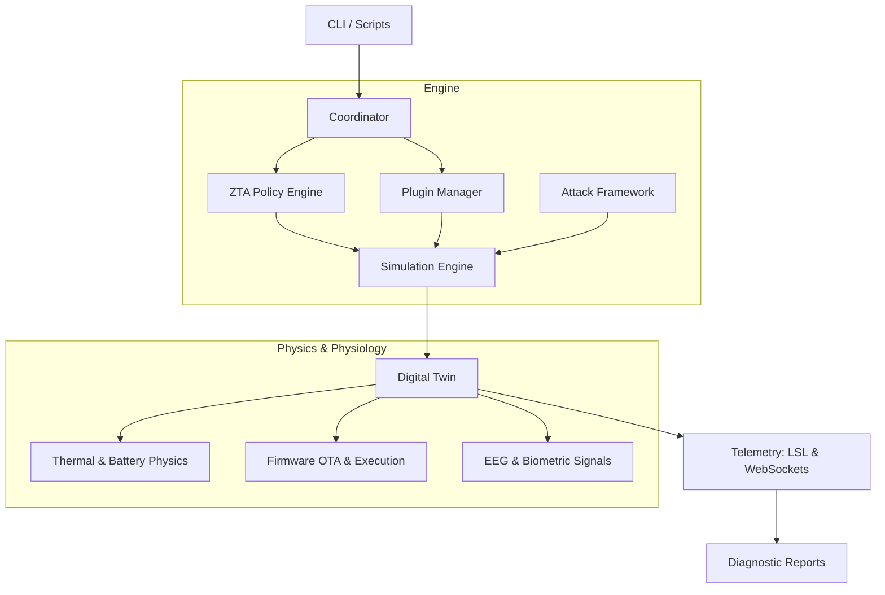

# VIREON: Virtual Laboratory for BCI Security

[](https://github.com/SaadiMalik1/neurosheild/actions/workflows/ci.yml)
[](https://www.python.org/downloads/)
[](https://opensource.org/licenses/MIT)
[](https://github.com/psf/black)
**Audience**: Security Researchers, Academic Researchers, Developers

## What is VIREON?
VIREON is an extensible cyber-physical simulation framework for research, validation, and security assessment of neurotechnology systems, including Implantable Brain-Computer Interfaces (BCI), Deep Brain Stimulators (DBS), and Vagus Nerve Stimulators (VNS). It simulates the complex interaction between malicious firmware/RF commands, device physics (battery, thermal constraints), and physiological tissue responses (EEG traces).

## Why does it exist?
As neurotechnology transitions from clinical labs to commercial availability, the attack surface expands. VIREON exists to model threats—such as unauthorized stimulation, telemetry manipulation, device denial-of-service, state inference, firmware compromise, and wireless protocol abuse—safely in a digital environment before they manifest in clinical reality. 

VIREON is influenced by the principles proposed in the OSI of Mind and Quantified Interconnection Framework (QIF), which are currently under active development.

## Who Should Use It?
- **Academic Researchers**: To model the physiological impact of adversarial stimuli without human subjects.
- **Security Researchers**: To develop and validate Intrusion Detection Systems (IDS) and Zero-Trust Architectures (ZTA) for medical implants.
- **Medical Device Engineers**: To test bounded execution, battery constraints, and anti-rollback safeguards on simulated firmware.

## Who Should NOT Use It?
- **Clinicians/Patients**: VIREON is a simulation tool. It is not diagnostic medical software and cannot be used to tune actual patient therapy.
- **General Hobbyists**: Without a foundational understanding of cyber-physical systems or neuro-engineering, the telemetry output may be misinterpreted.

## Current Maturity Level
VIREON is currently a **Research Prototype**. The core simulation loop is stable, but APIs and plugin architectures are subject to rapid, breaking changes.

## Scientific Disclaimer
> [!WARNING]
> **Not Medically Validated**: The physical and physiological equations modeled by VIREON (e.g., thermal tissue limits, generic EEG generation) are approximations built for cybersecurity threat modeling. They have **not** been validated for clinical accuracy and must not be used to make medical decisions.

---

## Architecture Overview



---

## Core Components

### Implemented
- **Digital Twin**: Simulates simplified representations of the physical state (battery, temperature) and clinical state (EEG, cognitive load) of the simulated patient.
- **Simulation Engine**: A tick-based execution loop that drives the physics models and synchronizes component states.
- **Coordinator**: The central orchestrator that manages the event bus, controls the simulation lifecycle, and routes requests to the Policy Engine.
- **ZTA Policy Engine**: A context-aware authorization engine that dynamically degrades system trust during active attacks.
- **NeuroIDS**: Prototype anomaly detection module.
  - *Purpose*: Detect statistically abnormal telemetry.
  - *Current implementation*: Linear Autoencoder (Numpy) and Deep Autoencoder (PyTorch).
- **Plugin System**: An event-driven architecture allowing researchers to inject custom device models, telemetry outputs, or attack vectors without modifying the core engine.
- **Attack Framework**: A registry of simulated adversarial behaviors, such as OTA Rollback manipulation and BLE MTU abuse.
- **Reporting**: Automated generation of HTML and PDF diagnostic reports detailing anomalies and physiological state changes post-simulation.
- **CLI**: The command-line interface for headless, reproducible simulation execution.
- **Dashboard**: A real-time Streamlit diagnostic web interface for visualizing EEG traces and physical metrics.

### Experimental
- **Runemate DSL**: An embedded Rust compiler for executing bounded, memory-safe clinical therapy scripts.
- **E2EE**: Symmetric key derivation and encryption layer for securing simulated telemetry streams.

### Future Work
- **Swarm Interference Emulator**: Cross-implant attack simulations (e.g., Pacemaker pivoting to DBS).
- **Hardware-in-the-Loop (HIL)**: Integration with physical OpenBCI boards.

---

## Validation Status

| Component | Status | Validation |
| --- | --- | --- |
| **Battery Model** | Prototype | Unit tested |
| **EEG Generator** | Experimental | Synthetic only |
| **BLE Simulator** | Stable | Integration tested |
| **IDS** | Prototype | Internal benchmark |
| **Thermal Model** | Prototype | Literature-derived |

---

## Roadmap

**v0.2**
- [x] Digital Twin physics and signals
- [x] Coordinator and Policy Engine separation
- [x] Extensible Plugin architecture

**v0.3**
- [ ] Automated reproducible benchmarks suite
- [ ] Hardware-in-the-loop (HIL) integration
- [ ] BLE packet fuzzing

**v1.0**
- [ ] Stable Python APIs
- [ ] Documentation freeze
- [ ] Research publication

---

## Installation & Prerequisites
See the [Installation Guide](INSTALL.md) for detailed instructions on Python virtual environments and Rust toolchains.

```bash
git clone https://github.com/SaadiMalik1/neurosheild.git
cd neurosheild
python3 -m venv .venv
source .venv/bin/activate
pip install -r requirements.txt
```

---

## Quick Start & Example Workflow

**1. Run a 10-second headless simulation with an active noise attack:**
```bash
python3 -m vireon run --duration 10.0 --attack noise
```

**2. Expected Output:**
```text
Simulation started...
Baseline telemetry OK.
[t=5.0s] Attack injected: NOISE
[NeuroIDS] Anomaly detected (confidence: 0.92)
[ZTA] Trust score degraded: 0.8 -> 0.4
[ZTA] Telemetry egress halted.
Simulation complete.
Report generated: reports/session.pdf
```

**3. Launch the Web Dashboard:**
```bash
python3 -m vireon ui --port 7777
```

---

## Project Structure
```text
vireon/
├── core/           # Coordinator, Engine, ZTA, IDS, Digital Twin
├── plugins/        # Firmware Emulators, BLE clients, Extensible datasets
├── tests/          # Pytest validation and manual verification scripts
├── runemate/       # Embedded Rust DSL Compiler
├── docs/           # Technical, scientific, and API documentation
└── main.py         # CLI entry point
```

## Documentation Links
- [Full Documentation Index](docs/index.md)
- [System Architecture](docs/architecture.md)
- [Threat Modeling & Security](docs/threat-model/README.md)
- [API Reference](docs/api.md)
- [Plugin Development Guide](docs/plugin-development.md)
- [Frequently Asked Questions](docs/FAQ.md)

---

## Contributing
We welcome contributions from researchers and engineers! Please read our [Contributing Guidelines](CONTRIBUTING.md) and [Code of Conduct](CODE_OF_CONDUCT.md).

## Support
For help, please refer to [SUPPORT.md](SUPPORT.md).

## License
VIREON is licensed under the MIT License - see the [LICENSE](LICENSE) file for details.

## Citation
If you use VIREON in your research, please cite it using the provided [CITATION.cff](CITATION.cff) file.
