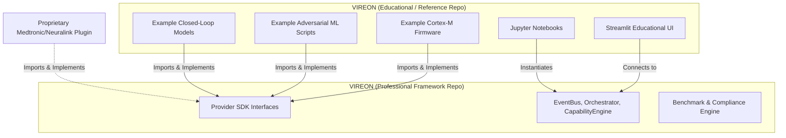
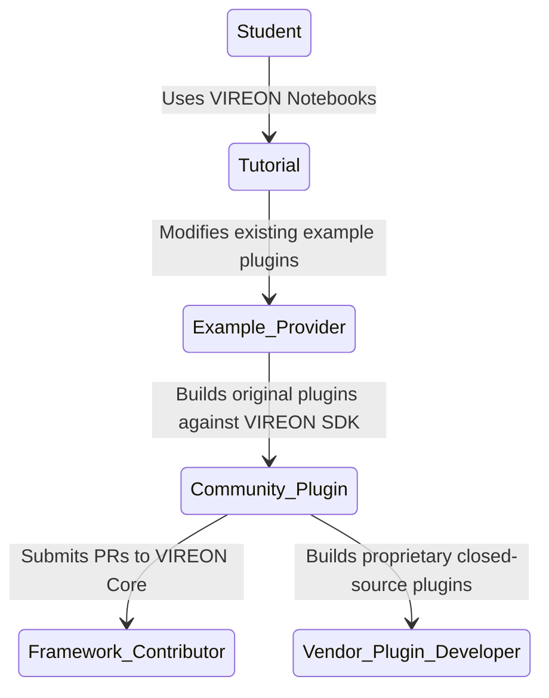

# The VIREON Ecosystem

## 1. Architectural Philosophy

VIREON has evolved from a monolithic educational simulator into a professional, vendor-neutral validation runtime for neurotechnology systems. 

To satisfy the divergent needs of our user base without compromising the architectural integrity of the framework, the VIREON project is strictly divided into two distinct repositories:

1. **VIREON**: The professional framework and validation infrastructure.
2. **VIREON `<SUFFIX>`**: The educational platform and official reference implementation.

*(Note: `<SUFFIX>` is a configurable placeholder. Downstream distributors or academic institutions may substitute `<SUFFIX>` with "Academy", "Edu", "Reference", etc. depending on their branding context. In these documents, we refer to it as `VIREON <SUFFIX>`)*

### Why Two Repositories?
A single repository mixing orchestration logic with educational "toy" implementations (like a mocked Cortex-M firmware or a Streamlit tutorial dashboard) creates catastrophic technical debt. 
- **Professional users** (Neuralink, Synchron, FDA researchers) require a minimal, hardened, high-performance validation engine without the bloat of visualization notebooks or reference firmware.
- **Educational users** (Students, Universities) require rich UI dashboards, heavily commented example code, and pre-built attack scenarios.

By separating the two, we achieve **Maximum Separation of Concerns** and **Stable Long-Term Maintenance**.

---

## 2. Repository Boundaries & Ownership

This matrix dictates what belongs where. The fundamental rule is: **If it defines how the system runs, it belongs in VIREON. If it is an *example* of something running on the system, it belongs in VIREON `<SUFFIX>`.**

| Component | VIREON | VIREON `<SUFFIX>` | Remove | Reason |
| :--- | :---: | :---: | :---: | :--- |
| **Orchestrator & EventBus** | ✅ | ❌ | ❌ | Core runtime engine. |
| **StateStore & PluginRegistry** | ✅ | ❌ | ❌ | Core runtime mechanics. |
| **CapabilityEngine & ZTA** | ✅ | ❌ | ❌ | Core security model. |
| **Provider SDK & Interfaces** | ✅ | ❌ | ❌ | Public API contract. |
| **Validation & Benchmark Engine** | ✅ | ❌ | ❌ | Professional testing infrastructure. |
| **Streamlit Dashboard** | ❌ | ✅ | ❌ | Educational UI. |
| **Tutorials & Notebooks** | ❌ | ✅ | ❌ | Learning content. |
| **Example Firmware (`plugins/firmware`)** | ❌ | ✅ | ❌ | Teaching/Reference provider. |
| **Example Clinical Models (`plugins/clinical`)**| ❌ | ✅ | ❌ | Reference physical models. |
| **Example Attacks (`attacks/`)** | ❌ | ✅ | ❌ | Pre-built threat scenarios for CTFs/Labs. |
| **Legacy `twin.py` & `coordinator.py`** | ❌ | ❌ | ✅ | Deprecated Monolithic God Objects. |

---

## 3. Dependency Direction

**The Golden Rule**: `VIREON <SUFFIX>` depends on `VIREON`. `VIREON` must **never** depend on `VIREON <SUFFIX>`.



The educational platform consumes *only* the public SDK interfaces (`vireon.sdk`). It must not hook into internal runtime memory structures or circumvent the EventBus.

---

## 4. Final Repository Structures

### VIREON
```text
VIREON/
├── src/vireon/
│   ├── core/           # Orchestrator, EventBus, StateStore, CapabilityEngine
│   ├── sdk/            # IProvider, SubprocessProvider, IPC wrappers
│   ├── security/       # ZTA, Guardrails, Authentication
│   ├── validation/     # Fuzzer, Compliance, SBOM, ThreatIntel
│   └── engine/         # ReplayEngine
├── docs/               # Framework Architecture, API Specs
├── tests/              # Core Unit Tests, Benchmark Tests
└── pyproject.toml
```

### VIREON `<SUFFIX>`
```text
VIREON_SUFFIX/
├── dashboard/          # Streamlit apps
├── tutorials/          # Markdown guides
├── notebooks/          # Jupyter notebooks for data analysis
├── scenarios/          # Pre-packaged CTF and attack scenarios
├── examples/
│   ├── firmware/       # Cortex-M stubs
│   ├── physics/        # Kuramoto models
│   ├── decoders/       # ML Decoder examples
│   ├── ids/            # Example Intrusion Detection Systems
│   ├── telemetry/      # Example protocol parsers
│   └── battery/        # Example power drain models
├── datasets/           # Sample neural telemetry captures
├── docs/               # Walkthroughs, Lesson Plans
└── pyproject.toml      # Requires: vireon-core >= 1.0.0
```

---

## 5. Shared Versioning Strategy

VIREON and VIREON `<SUFFIX>` use a synchronized but decoupled versioning matrix.

### Versioning Matrix
- `VIREON` uses strict **Semantic Versioning** (`MAJOR.MINOR.PATCH`).
- `VIREON <SUFFIX>` tracks the **MAJOR** and **MINOR** versions of the framework it is designed for. 

**Example Flow**:
```text
VIREON 1.0.0 Released
       ↓
VIREON <SUFFIX> 1.0.0 Released (Depends on VIREON ~1.0.0)
       ↓
VIREON 1.1.0 Released (Added new validation feature)
       ↓
VIREON <SUFFIX> 1.1.0 Released (Added a tutorial for the new feature)
       ↓
Proprietary Plugin Developer (Can use VIREON 1.1.0 in CI/CD without the educational platform)
```

**Compatibility Guarantee**:
If an academic lab writes a custom tutorial against `VIREON <SUFFIX> 1.0.0`, they are guaranteed that the underlying `vireon.sdk` will not break their code unless `VIREON` increments to `2.0.0`.

---

## 6. Contributor Workflows

The split ecosystem naturally guides contributors through an escalating path of expertise.



- **Bug in a tutorial?** PR goes to `VIREON <SUFFIX>`.
- **Bug in the EventBus?** PR goes to `VIREON`.
- **New Plugin idea?** If it's a general teaching tool, PR to `VIREON <SUFFIX>/examples`. If it's a proprietary tool, it stays in the vendor's private repo using the VIREON SDK.

---

## 7. Documentation Ownership

| Documentation Type | Belongs In | Rationale |
| :--- | :--- | :--- |
| Core Architecture (`RUNTIME_REDESIGN.md`) | `VIREON` | Dictates how the framework operates. |
| Interface Contracts (`VENDOR_SDK.md`) | `VIREON` | Defines the API for developers. |
| Security Model (`CAPABILITY_SYSTEM.md`) | `VIREON` | Defines enforcement mechanisms. |
| Installation Guides (Quickstart) | `Ecosystem` | Hosted on the main website pointing users to their specific need. |
| Walkthroughs & Labs | `VIREON <SUFFIX>` | Educational narrative content. |
| Plugin Reference Implementations | `VIREON <SUFFIX>` | Docs specific to the example plugins. |

---

## 8. Branding Guidelines

- **VIREON**: The brand name for the framework. Professional, minimal, clinical.
- **VIREON `<SUFFIX>`**: The educational platform. Approachable, experimental. The `<SUFFIX>` must remain a highly visible configurable variable (e.g., in `make` files or environment variables) so universities can brand their deployments (e.g., `VIREON Stanford`, `VIREON Medtronic-Academy`).
- **Unified Identity**: Both repositories will share the same root GitHub organization or GitLab namespace. The logos will be identical, with the `<SUFFIX>` version featuring an accent color or a subtitle bracket `[ <SUFFIX> ]`.

---

## 9. Critical Architectural Review

### Identifying Weaknesses in the Separation Proposal

1. **Version Drift Risk**: `VIREON <SUFFIX>` might fall behind `VIREON` updates. If `VIREON` releases v2.0, the educational notebooks in `VIREON <SUFFIX>` will break until someone updates them.
2. **Duplication of Test Harnesses**: `VIREON <SUFFIX>` will need to write tests for its example plugins. It might end up duplicating test harness logic that `VIREON` already has in its `validation` module.
3. **Adoption Friction**: New users might clone `VIREON` thinking they can just run it, only to find there is no UI, no examples, and no immediate visual output.

### Improving the Proposal
To mitigate these risks, the final ecosystem architecture mandates:
1. **Automated CI Integration**: `VIREON <SUFFIX>` will be added as a downstream CI trigger for `VIREON`. A PR to `VIREON` cannot be merged if it breaks the integration tests in `VIREON <SUFFIX>`. This mathematically prevents Version Drift.
2. **Test Harness SDK**: `VIREON/src/vireon/validation/` will expose a public `vireon.testing` module. `VIREON <SUFFIX>` will import this module to test its example plugins, entirely eliminating test harness duplication.
3. **Ecosystem Meta-Package**: A `pip install vireon-all` (or equivalent) metapackage will exist that installs both `vireon-core` and `vireon-suffix`. The `VIREON` README will explicitly route beginners to `VIREON <SUFFIX>`.
