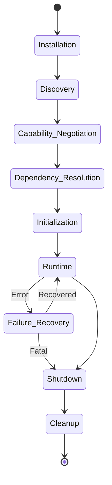

# Plugin Lifecycle

## Overview
To prevent complex neurotechnology simulations from degrading into race conditions and deadlocks, VIREON strictly defines the plugin execution lifecycle. 

This document describes how a Provider (Plugin) moves from discovery to execution and eventual removal.

## The Lifecycle Phases

### 1. Installation
Plugins are installed into the `vireon_plugins/` directory or compiled as standalone binaries that the `SubprocessProvider` wrapper knows how to execute. Installation defines the static presence of the plugin.

### 2. Discovery
During Orchestrator boot, the `PluginRegistry` scans known directories, parses Entry Points, and loads the `CapabilityManifest` for each available plugin.

### 3. Capability Negotiation
The `CapabilityEngine` cross-references the requested capabilities of the plugin against the `ExperimentConfig` overrides. If a plugin demands `WRITE_STATE` but the user config forces `READ_ONLY`, negotiation fails and the plugin is unloaded before initialization.

### 4. Dependency Resolution
Plugins may depend on events emitted by other plugins (e.g., the `ClinicalProvider` requires the `PhysicsProvider` to exist). The Orchestrator builds a Directed Acyclic Graph (DAG) to ensure the `initialize()` methods are called in the correct, non-blocking order.

### 5. Initialization
The Orchestrator calls `IProvider.initialize(context)`. The plugin:
- Subscribes to necessary `EventBus` topics.
- Pre-allocates memory or buffers.
- Spawns any internal threads (if in-process).

### 6. Runtime Execution
The primary simulation loop. The plugin reacts exclusively to events (like the `system.tick`) over the `EventBus`. It publishes results back to the bus or mutates permitted keys in the `StateStore`.

### 7. Failure Recovery
If a plugin crashes (especially relevant for `SubprocessProvider` wrapped binaries):
- The Orchestrator captures the `SIGSEGV` or exception.
- It logs the failure and attempts to restart the binary **once**, restoring its state from the `StateStore`.
- If it fails again, it triggers a cascade `ShutdownEvent`.

### 8. Shutdown
Triggered by test completion or a fatal error. The Orchestrator publishes `system.shutdown`. Providers must close sockets, terminate threads, and cease operations.

### 9. Cleanup
The Orchestrator aggressively garbage collects the Python instances or SIGKILLs the subprocesses to ensure no orphaned processes leak into the host operating system.

### 10. Upgrade & Removal
Plugins can be hot-swapped between simulation runs (but never during). Upgrading a plugin requires a new Discovery phase to re-verify the `CapabilityManifest`.
