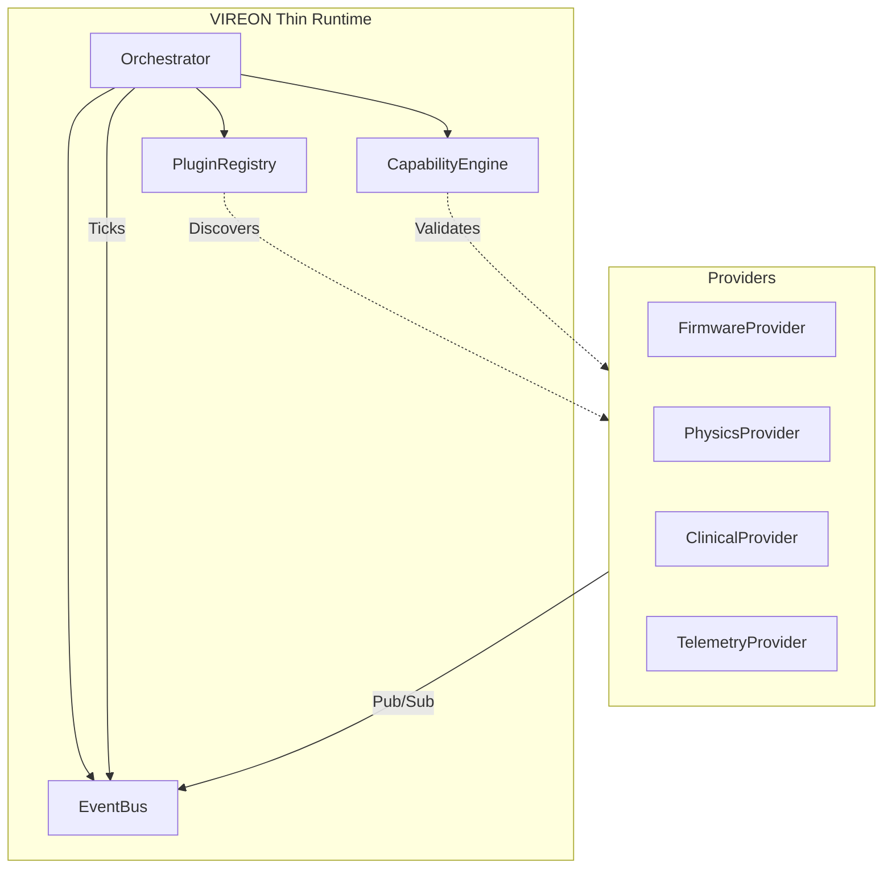

# VIREON Runtime Redesign (Phase 2)

## 1. Goal
Transform the current monolithic `Coordinator` into a thin, agnostic Orchestration Runtime. The new runtime must not import, instantiate, or possess any knowledge of concrete neuro-device implementations, cyber-attacks, or clinical simulations. It will strictly orchestrate Provider interfaces based on a capability-negotiated manifest.

## 2. Runtime Responsibilities
The thin Orchestration Runtime is responsible ONLY for:
1. **Lifecycle Management**: Bootstrapping, starting, pausing, resuming, and shutting down the environment.
2. **Provider Registration & Discovery**: Dynamically loading plugins that satisfy defined Provider interfaces via a `PluginRegistry`.
3. **Event Routing**: Instantiating and managing the central `EventBus` to route pub/sub messages between disconnected Providers.
4. **Clock Synchronization**: Maintaining the global deterministic `sim_clock` and dispatching tick events to Providers.
5. **Capability Resolution**: Verifying that requested capabilities (e.g., mutate memory, observe telemetry) are explicitly granted by the `ExperimentConfig` before allowing a Provider to initialize.

**What it will NOT do:**
- Manage specific device configurations (e.g., OpenBCI, Neuralink).
- Know about "threat levels" or "clinical status".
- Evaluate cyber kill-chains.
- Define what a "Digital Twin" is.

## 3. Lifecycle

1. **BOOTSTRAP**:
   - Initialize `EventBus`.
   - Initialize `PluginRegistry`.
   - Parse `ExperimentConfig` (now just a list of generic Providers and Capabilities).
2. **RESOLUTION**:
   - Registry discovers requested Providers.
   - Capability Engine verifies all requested permissions.
   - If a Provider requests ungranted capabilities, panic and abort.
3. **INITIALIZATION**:
   - Instantiate Providers using constructor dependency injection (passing only interfaces like `IEventBus`).
   - Providers subscribe to relevant Event topics.
4. **EXECUTION (The Loop)**:
   - Orchestrator advances `sim_clock` by `dt`.
   - Orchestrator publishes `TickEvent(time=sim_clock, dt=dt)`.
   - Providers independently act upon the tick.
   - Orchestrator processes asynchronous IPC/RPC messages from external boundaries.
5. **TEARDOWN**:
   - Orchestrator publishes `ShutdownEvent`.
   - Providers flush logs, close sockets, and clean up.

## 4. Dependency Graph



## 5. Event Flow

1. Orchestrator ticks the clock: `EventBus.publish("system.tick", {"clock": 1.0, "dt": 0.01})`
2. `PhysicsProvider` receives tick, calculates voltage sag, publishes: `EventBus.publish("physics.state_update", {"battery": 95.0})`
3. `FirmwareProvider` receives tick, reads battery via its capability map, executes 10ms of ARM assembly.
4. `FirmwareProvider` decides to stimulate, publishes: `EventBus.publish("device.stimulate", {"amp_ma": 5.0})`
5. `ClinicalProvider` receives stimulation event, calculates neurophysiological response, publishes: `EventBus.publish("clinical.eeg_update", {"channels": [...]})`

No Provider imports any other Provider. They only share schema definitions for Event payloads.

## 6. State Machine

The central `DigitalTwin` class will be dissolved as a God object.
Instead, state is decentralized:
- **State Definition**: A lightweight `StateStore` (in-memory Key-Value store) managed by the Orchestrator.
- **State Mutation**: Providers publish state mutation intents via the EventBus. If the CapabilityEngine confirms the Provider has the capability to mutate that key, the `StateStore` updates and broadcasts a state-changed event.

## 7. Capability Resolution

Every plugin must define a `CapabilityManifest` during discovery.
Example:
```yaml
provider: vendor_x_firmware
capabilities:
  subscribe:
    - "clinical.eeg_update"
  publish:
    - "device.stimulate"
  mutate_state:
    - "device.memory"
  system:
    - "spawn_subprocess" # High risk
```
During the RESOLUTION phase, the `CapabilityEngine` compares this manifest against the locked `ExperimentConfig`. If `vendor_x_firmware` attempts to publish an event it hasn't declared, the `EventBus` drops the message and flags a security violation.

## 8. Runtime Ownership Boundaries

To prevent the orchestration runtime from slowly regressing into another monolithic "God Object," strict ownership boundaries are enforced. The runtime must never bleed into domain logic.

**The Runtime OWNS:**
* ✔ **Lifecycle**: Bootstrapping, ordered initialization, and teardown of the simulation.
* ✔ **Scheduling**: Advancing the monotonic `sim_clock` and dispatching ticks.
* ✔ **Event Bus**: In-memory message brokering and topic isolation.
* ✔ **Capability Resolution**: Parsing manifests and enforcing zero-trust capability proxies.
* ✔ **State Store Mechanism**: The thread-safe Key-Value dictionary (but not its contents).
* ✔ **Logging & Metrics**: Standardizing stdout/stderr streams from subprocesses and recording framework-level telemetry.

**The Runtime DOES NOT OWN:**
* ✘ **Firmware Execution**: The runtime does not know what an ARM Cortex-M is.
* ✘ **Protocol Stack**: The runtime does not implement BLE, TCP, or proprietary neuro-protocols.
* ✘ **Decoders/Algorithms**: The runtime has no concept of what "spike sorting" or "LFP" means.
* ✘ **Intrusion Detection (IDS)**: The runtime enforces security policy, but does not analyze traffic for anomalies.
* ✘ **Battery Mechanics**: The runtime does not calculate Joule drain or voltage sag.
* ✘ **Device State**: The runtime holds the `StateStore`, but the *meaning* of state values (e.g., `hazard_state`) belongs exclusively to the domains that declared them.
