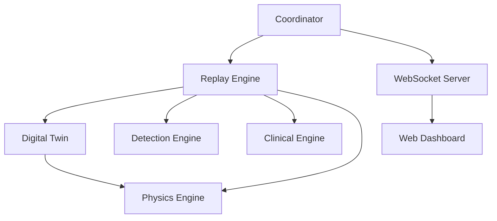

# VIREON Architecture

The VIREON platform is composed of distinct modules that interact strictly through defined interfaces. The architecture is designed to prioritize performance, state isolation, and accurate physical emulation, separating the "brain" (the digital twin) from the "nervous system" (the telemetry and coordination layer).

## Architecture Overview

## 1. Digital Twin (`twin.py`)

The `DigitalTwin` is the core state machine of the Virtual Laboratory. It maintains the physical and clinical state of the simulated BCI device.

### Concurrency Model
To support high-frequency simulation safely, the Digital Twin utilizes a unified **`threading.RLock()`** to serialize state access across the ReplayEngine thread and asynchronous RPC telemetry endpoints. This unified lock eliminates race conditions, state tearing, and deadlocks that plagued previous multi-lock implementations, preserving authoritative ground truth determinism across all integrated physics and clinical computations.

### Physics Engine
The `DigitalTwin` delegates complex thermodynamic and electrical boundary calculations to the `PhysicsEngine`. When the ReplayEngine triggers `set_sim_clock`, the twin automatically simulates:
1. **Battery Sag**: Exponential power draw based on stimulation amplitude and frequency.
2. **Thermal Rise**: Tissue temperature increases modeled off stimulation current.
3. **Brownout Scenarios**: If the battery dips below a safe threshold during an active stimulation pulse, the device enters a simulated brownout state.

## 2. Coordinator (`coordinator.py`)

The `Coordinator` is the orchestration layer that ties the simulation together. 
*Note: In the current prototype, the Coordinator functions as a monolithic "God class" that binds together the engines, logging, and state directly, violating strict decoupling principles. Future updates aim to modularize this.*

### The ReplayEngine Loop
The core of the simulation is a strict timing loop managed by the `ReplayEngine`. It:
- Pushes synthetic or pre-recorded EEG data into the twin at the defined `sample_rate`.
- Dispatches this data to the modular analysis pipelines (Detection, Clinical, Physics).
- Calculates physical constraints and battery usage based on elapsed `dt`.

### Telemetry Dispatch
The `Coordinator` is responsible for broadcasting the internal state of the `DigitalTwin` to external consumers:
- **WebSocket Server (`asyncio`)**: Streams real-time `state`, `eeg`, and `threat` packets to the external clients (like the Streamlit dashboard).
- **Lab Streaming Layer (LSL)**: (Optional) Pushes raw multiplexed signal data to LSL streams for consumption by clinical BCI tools like OpenViBE.

### Configuration
The `ExperimentConfig` is defined using a structured **Pydantic** model (`core/config.py`), replacing loose dict structures, providing robust type validations for physical constants and security thresholds.

## 3. NeuroDSL Compiler Stack (`compiler/`)

VIREON incorporates **NeuroDSL**, an embedded Rust-based Domain Specific Language (DSL) used for defining clinical therapy scripts. The Rust extension is compiled and bound to Python using **maturin**.

Currently, the Rust VM integrates directly into the Python thread. **Note: It does not yet provide isolation.** Malformed bytecode or untrusted input can execute synchronously and crash or hang the entire simulation.

1. **Forge (The Frontend Compiler)**: 
   - A high-level parser that takes human-readable NeuroDSL scripts (e.g., `SET_AMP 5.0`) and compiles them into a binary format known as 'Staves'.

2. **Scribe (The Embedded Interpreter)**: 
   - Executes the compiled Staves bytecode inside the virtual environment.
   - Triggers physical changes in the `DigitalTwin` (e.g., increasing `stimulation_amplitude_ma`).

## 4. Web Dashboard (`dashboard/app.py`)

The VIREON platform includes an interactive dashboard built with **Streamlit** that pulls live telemetry from the Coordinator's WebSocket stream.

- **Real-Time Visualization**: Renders high-speed EEG traces utilizing Plotly.
- **State Panels**: Displays live `DigitalTwin` physical states (battery, temp, impedance) and alerts.
- **Threat Intel Panel**: Visualizes active detections, **Red Team Engine** feedback scores, and their mapped qTARA classifications. 

The dashboard provides a closed-loop environment where researchers can observe physiological responses, trigger runtime simulated attacks, and analyze the SecurityEngine mitigations interactively.

## 5. Cyber Kill Chain Engine (`attack_chain/`)

VIREON incorporates a **Cyber Kill Chain** evaluator conceptually modeling a 7-stage adversarial progression:
1. Reconnaissance
2. Initial Access
3. Protocol Abuse
4. Privilege Escalation
5. Persistence
6. Execution
7. Recovery

*Note: While the directory exists and models this progression, the actual integration into the `ReplayEngine` is currently synchronous and tightly coupled, ignoring the defined abstractions. Architectural decoupling is planned for future work.*

## 6. Declarative Threat Models (`threat_models/`)

Ecosystem-specific threat models are implemented as declarative YAML configurations rather than hard-coded scripts.
Models (such as `dbs.yaml`, `vns.yaml`, `cochlear.yaml`, and `bci.yaml`) explicitly map:
- **Assets**: Identifying IPGs, Companion Apps, and Cloud backends.
- **Trust Boundaries**: The specific boundaries crossed by physical and digital telemetry.
- **Attack Paths**: The exact capabilities required to compromise an asset.

These models are ingested by `core.config` and establish the context for the `AttackChain` and Zero-Trust Policy Engine.

## 7. Capture-The-Flag Engine (`ctf/`)

To support education and interactive validation, VIREON embeds a Capture-The-Flag (CTF) engine. 
- It loads structured `.json` neurosecurity challenges.
- Challenges validate specific user interactions and flag submissions against the live simulated state or analytical outputs.

## 8. Hardware-in-the-Loop (HIL) & Physical Integration

The platform provides a flexible plugin architecture (`vireon/plugins/`) to move beyond pure simulation:
- **QEMU HIL Emulation**: Real ARM firmware binaries can be loaded and executed within a `qemu-system-arm` process (`QemuCortexMEmulator`). Telemetry is bridged securely over dedicated TCP ports, allowing hardware-accurate behavioral testing of actual device payloads.
- **True BLE Connectivity**: Connects to physical hardware in the real world using the `TrueBLEClient` (powered by `bleak`). This enables testing of live cyber-physical attacks against production-grade RF endpoints.
