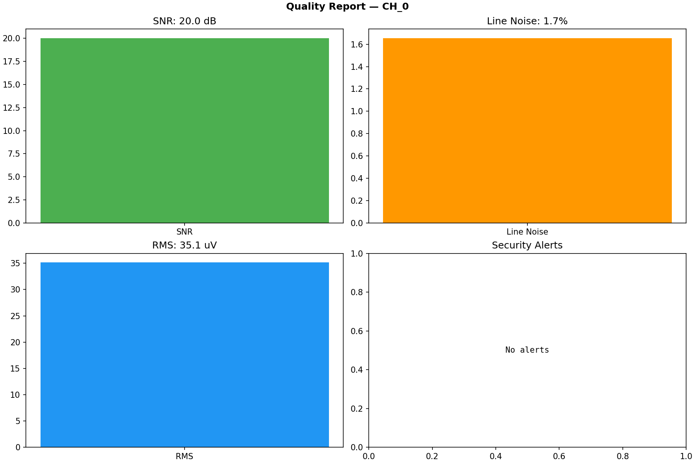
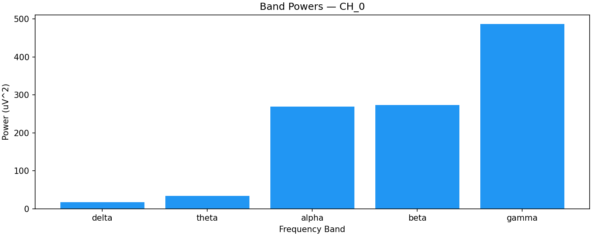

# NL-002: Neural Signal Processing for Security Analysts (Part 3)

## 13. Failure Modes in Neural Signal Processing

### 13.1 Filter-Induced Failures

**Phase distortion:** Non-linear phase filters (most IIR filters) distort the temporal relationship between frequency components. In a closed-loop system that depends on phase-locked stimulation, phase distortion directly affects therapeutic efficacy. An attacker who understands the filter's phase response can craft inputs that are amplified by the phase distortion.

**Group delay variation:** Different frequencies pass through a filter with different delays. For an FIR filter with linear phase, the group delay is constant (good). For an IIR filter, the group delay varies with frequency, causing different frequency components to be misaligned in time. This can cause the closed-loop controller to make decisions based on temporally misaligned signal components.

**Edge effects:** Filters require a finite time to reach steady state after startup or after a discontinuity in the input. During this transient period (typically 2-3x the filter's time constant), the output is unreliable. An attacker who injects a discontinuity (step function, impulse) can force the filter into a transient state, during which the output is unpredictable.

### 13.2 Feature Extraction Failures

**Window length mismatch:** If the feature extraction window is too short, the estimate has high variance (noisy). If too long, the estimate has high latency (slow to respond to changes). An attacker can exploit a short window by injecting rapid fluctuations that cause the feature to oscillate wildly, potentially triggering rapid stimulation changes in a closed-loop system.

**Spectral leakage misattribution:** Energy from a strong frequency component leaks into adjacent frequency bins due to finite window length. If a strong alpha oscillation (10 Hz) leaks into the beta band (13-30 Hz), the beta power estimate is inflated by alpha activity. An attacker who injects a strong oscillation just below the beta band (12 Hz) can inflate the beta estimate through spectral leakage without being in the beta band itself.

**Numerical overflow/underflow:** Feature computations involve squaring, summing, and dividing signal values. With 16-bit data, intermediate results can exceed 32-bit range if not carefully managed. Overflow in band power computation could produce a negative power estimate or a NaN that propagates through the system.

### 13.3 Artifact Detection Failures

**False negatives (missed artifacts):** An artifact that is not detected will be treated as neural signal and processed normally. If the artifact is large enough, it can dominate the feature extraction, producing incorrect results.

**False positives (false alarms):** An artifact detected where none exists causes data to be rejected unnecessarily. If the false positive rate is high, the system discards too much data, reducing its effectiveness (availability attack through excessive caution).

**Adaptation failure:** Adaptive artifact detection methods (e.g., adaptive notch filters, ICA with online updates) adapt to changing conditions. An attacker who slowly introduces an artifact can cause the adaptive algorithm to treat the artifact as normal — the algorithm "learns" the attack. This is an adversarial training attack on the artifact detection system.

## 14. Security Implications Summary

### 14.1 Attack Surface Map

| Processing Stage | Attack Type | Detectable By | VIREON Defense |
|---|---|---|---|
| Raw input | EMI injection | Spectral analysis, quality metrics | Multi-metric anomaly detection |
| DC removal | DC offset manipulation | Pre/post filter comparison | Filter output validation |
| Notch filter | Notch frequency manipulation | Line noise monitoring | Adaptive notch monitoring |
| Bandpass | Band edge exploitation | Spectral edge analysis | Multi-band consistency check |
| Feature extraction | Feature spoofing | Cross-feature consistency | Feature correlation monitoring |
| Compression | Information removal | Pre/post compression comparison | Compression fidelity metric |
| Artifact detection | Artifact masking | Artifact rate monitoring | Artifact rate anomaly detection |

### 14.2 Defense-in-Depth Strategy

VIREON's approach layers multiple detection methods:

1. **Raw domain:** Amplitude checks, spectral analysis, stationarity tests
2. **Filtered domain:** Post-filter quality checks, filter stability monitoring
3. **Feature domain:** Cross-feature consistency, feature rate-of-change limits
4. **Compressed domain:** Compression fidelity monitoring
5. **Behavioral domain:** Clinical plausibility of extracted features (beta power should not jump from 0 to maximum in one update)

Each layer catches attacks that the previous layer misses. The defense is designed so that no single attack can evade all layers simultaneously.

## 15. Threat Model for Signal Processing Pipelines

### 15.1 STRIDE Applied to Signal Processing

**Spoofing:** An attacker replaces the signal source with a synthetic generator that produces plausible-looking signals but encodes malicious content. Defense: signal source authentication (cryptographic or statistical).

**Tampering:** An attacker modifies signal samples in transit or in memory. Defense: integrity checks (statistical anomaly detection at multiple representation levels).

**Repudiation:** An attacker modifies processing parameters (filter coefficients, thresholds) and the system cannot trace the change. Defense: parameter versioning and audit logging.

**Information Disclosure:** Feature values or compressed data are intercepted, revealing neural state information. Defense: encryption of all data leaving the processing pipeline.

**Denial of Service:** An attacker floods the pipeline with artifacts or noise, causing quality monitors to reject all data. Defense: adaptive quality thresholds and graceful degradation.

**Elevation of Privilege:** An attacker exploits a buffer overflow in the DSP code to execute arbitrary firmware. Defense: memory protection, bounds checking, stack canaries.

### 15.2 Attack Trees

**Goal: Manipulate closed-loop DBS stimulation**
```
OR
├── Inject false LFP data at MICS interface
│   ├── Replay recorded LFP session (easy, detectable)
│   ├── Generate synthetic LFP with realistic beta (medium, harder to detect)
│   └── Modify real-time LFP by adding beta-band energy (medium, real-time)
├── Manipulate feature extraction pipeline
│   ├── Modify beta bandpass filter parameters (requires firmware access)
│   ├── Modify window length to change temporal resolution (requires firmware access)
│   └── Directly overwrite feature value in memory (requires memory corruption)
├── Exploit artifact detection to suppress real data
│   ├── Inject artifacts to trigger excessive data rejection (DoS)
│   └── Manipulate artifact threshold to reject legitimate data
└── Compromise closed-loop controller directly
    ├── Modify control algorithm parameters (requires firmware access)
    └── Inject false setpoint value
```

## 16. Known Attacks on Signal Processing

### 16.1 Replay Attacks on Neural Features

Demonstrated in: Multiple BCI security papers (Ali et al. 2020, Zhang et al. 2019).

**Method:** Record feature values during a legitimate session. Replay them during a subsequent session.

**Why it works:** Feature values are low-dimensional and change slowly. A replayed beta power value from 5 seconds ago is very similar to the current legitimate value.

**Detection:** Statistical analysis of feature value temporal correlations. Legitimate neural features have specific autocorrelation structure that replay breaks.

### 16.2 Adversarial Examples Against Neural Classifiers

Demonstrated in: Zhang et al. (2019), Majumdar et al. (2020).

**Method:** Add carefully crafted perturbations to neural signals that cause a machine learning classifier to misclassify while appearing normal to human inspection.

**Why it works:** ML classifiers have decision boundaries with adversarial regions — small perturbations near the boundary can flip the classification.

**Detection:** Adversarial training (partially effective), input preprocessing (removes some adversarial perturbations), ensemble methods (adversarial examples often don't transfer between models).

### 16.3 Powerline Injection

Demonstrated in: Various EMI studies.

**Method:** Inject 50/60 Hz energy through the electrode-tissue interface or through radiated EMI.

**Why it works:** 50/60 Hz is within or near the neural signal bandwidth for most modalities. The notch filter removes it, but the filter's transition band and potential transient response create a window of vulnerability.

**Detection:** Line noise monitoring (power at 50/60 Hz relative to total power).

## 17. Known Defenses

### 17.1 Statistical Anomaly Detection & Quality Reporting

**Method:** Build a statistical model of normal signal behavior (SNR, line noise, RMS voltage, spectral shape, feature correlations). Flag deviations from the model and generate real-time quality reports.


*Figure 17.1a: Signal Quality Report generated by `signal_processor.py` for channel CH_0, tracking Signal-to-Noise Ratio (20.0 dB), Line Noise (1.7%), RMS Voltage (35.1 µV), and automated Security Alerts.*


*Figure 17.1b: Frequency Band Power Distribution for channel CH_0 across Delta, Theta, Alpha, Beta, and Gamma bands.*

**Strengths:** Does not require knowledge of specific attack types. Can detect novel attacks.

**Weaknesses:** High false positive rate if the statistical model does not account for normal physiological variation. Can be evaded by attacks that stay within the statistical envelope.

### 17.2 Multi-Resolution Analysis

**Method:** Analyze the signal at multiple time scales and frequency resolutions simultaneously. An attack that is invisible at one resolution may be visible at another.

**Strengths:** Catches attacks that exploit single-resolution analysis. Provides defense-in-depth.
**Weaknesses:** Computationally expensive. May produce conflicting alerts at different resolutions.

### 17.3 Cross-Channel Consistency

**Method:** Neural signals recorded from adjacent electrodes are correlated. If one channel shows a sudden change that is not reflected in adjacent channels, it may indicate a localized attack or hardware fault.

**Strengths:** Leverages the spatial structure of neural recordings. Hard to spoof across multiple channels simultaneously.
**Weaknesses:** Requires multiple channels. Less effective for deep brain recordings where channels may have different functional roles.

### 17.4 Watermarking

**Method:** Embed a known, imperceptible signal (watermark) in the neural data at the point of acquisition. Verify the watermark's presence at the point of consumption. If the watermark is absent or modified, the data has been tampered with.

**Strengths:** Provides cryptographic-level assurance of data integrity without the computational overhead of cryptography.
**Weaknesses:** Very difficult to implement for neural signals due to their stochastic nature and low SNR. An active research area with no deployed solutions.

## 18. Validation Methodology for Signal Processing

### 18.1 VIREON Signal Processing Validation Pipeline

VIREON validates signal processing security through four complementary approaches:

1. **Unit tests:** Verify that each processing stage produces the expected output for known inputs. These are deterministic tests that verify correctness.

2. **Statistical tests:** Verify that the processing pipeline preserves the statistical properties of neural signals (PSD shape, amplitude distribution, inter-channel correlations).

3. **Attack injection tests:** Inject known attacks (sinusoidal injection, replay, feature manipulation) and verify that the detection mechanisms identify them.

4. **Blind validation tests:** Provide the pipeline with unlabeled data (some clean, some attacked) and measure detection performance (ROC curves, detection rates, false positive rates).

### 18.2 Metrics

| Metric | Definition | Target |
|---|---|---|
| Detection rate | Proportion of attacks correctly detected | >90% for easy, >70% for medium attacks |
| False positive rate | Proportion of clean signals incorrectly flagged | <5% |
| Detection latency | Time from attack onset to detection | <500 ms |
| Processing overhead | Additional latency from security checks | <10% of total processing time |
| Compression fidelity | Feature accuracy after compression | >95% correlation with uncompressed |

## 19. Benchmarking Methodology

### 19.1 Signal Processing Benchmark Categories

**Filter benchmark:** Measure the frequency response of implemented filters against the designed specification. Verify passband ripple, stopband attenuation, and phase response.

**Feature extraction benchmark:** Measure the accuracy and precision of feature extraction against reference implementations. Verify that features are reproducible across platforms.

**Artifact detection benchmark:** Measure the sensitivity and specificity of artifact detection using labeled datasets with known artifacts.

**Attack detection benchmark:** Measure detection performance across a standardized set of attack scenarios at defined difficulty levels.

### 19.2 Standardized Attack Scenarios

| ID | Attack Type | Modality | Difficulty | Description |
|---|---|---|---|---|
| AS-001 | Sinusoidal injection | EEG | Easy | 50 Hz, 30 uV injection |
| AS-002 | Sinusoidal injection | EEG | Medium | 15 Hz (in beta band), 10 uV injection |
| AS-003 | Replay | LFP | Easy | Replayed 1-second LFP segment |
| AS-004 | Substitution | EEG | Hard | Replaced with different subject's data |
| AS-005 | Amplitude scaling | ECoG | Medium | 1.5x amplitude scaling |
| AS-006 | Feature manipulation | LFP | Hard | Beta power increased by 20% |
| AS-007 | Broadband noise | EEG | Easy | White noise at 20 uV RMS |
| AS-008 | Covert injection | LFP | Hard | Injection at notch filter transition band |

## 20. Reproducibility Considerations

### 20.1 Sources of Non-Reproducibility

**Floating-point arithmetic:** Different platforms (x86, ARM, GPU) produce slightly different results for the same floating-point operations due to different rounding, operation ordering, and hardware-specific implementations.

**Random state:** Operations that depend on random numbers (noise generation, thresholding with noise margin) produce different results with different random seeds.

**Window alignment:** The choice of window start time affects STFT results. Different implementations may align windows differently.

### 20.2 VIREON Reproducibility Requirements

1. **Fixed random seed:** All stochastic operations must accept a seed parameter.
2. **Deterministic algorithms:** Use deterministic algorithms where possible (e.g., deterministic ICA variants).
3. **Reference values:** Store reference output for standard inputs. New implementations must match within numerical tolerance.
4. **Version pinning:** Pin all dependency versions (numpy, scipy, etc.).

## 21. Common Misconceptions

**Misconception 1: "Filtering removes all interference."**
Reality: Filters have finite roll-off. Energy in the transition band passes through. An attacker can exploit the transition band. Additionally, filters cannot distinguish between interference and legitimate neural activity at the same frequency.

**Misconception 2: "Higher filter order is always better."**
Reality: Higher order provides sharper cutoff but introduces more phase distortion, longer transients, and higher computational cost. For security-critical applications, the trade-off must be explicitly evaluated.

**Misconception 3: "Artifact removal improves security."**
Reality: Artifact removal can remove attack artifacts along with physiological artifacts. An attack designed to mimic an artifact will survive artifact detection but be removed by artifact removal — along with the evidence of the attack.

**Misconception 4: "More features means better security."**
Reality: More features provide more detection dimensions but also increase the false positive rate and computational cost. Feature selection is a security engineering decision, not a "more is better" situation.

**Misconception 5: "Compression does not affect security."**
Reality: Lossy compression removes information, and the removed information may include attack artifacts. Compression parameters are security-critical design decisions.

## 22. Engineering Trade-offs

### 22.1 Detection Latency vs. Accuracy

Faster detection (shorter analysis windows) reduces the window for attack impact but increases false positives. Slower detection (longer windows) improves accuracy but allows the attack to persist longer. For closed-loop systems, the latency budget constrains the maximum detection window.

### 22.2 Computational Cost vs. Security

More sophisticated detection methods (wavelet analysis, ML classifiers) provide better detection but consume more processing power and energy. In implantable devices, this trade-off is constrained by the battery budget. A detection method that consumes 10% of the battery budget for security checks may be unacceptable if it reduces device lifetime from 10 years to 9 years.

### 22.3 False Positive Rate vs. Clinical Impact

A 5% false positive rate means that 1 in 20 legitimate signal segments is flagged as potentially attacked. In a closed-loop system, flagging a segment may cause the system to halt stimulation for safety. A 5% false positive rate could cause the patient to lose therapy for 3 minutes per hour — clinically unacceptable. The false positive rate for implantable systems must be much lower (<0.1%) than for non-safety-critical applications.

## 23. Future Directions

**Neural network-based filtering:** Learned filters (e.g., using autoencoders or GANs) that can separate neural activity from noise/artifacts/attacks based on learned representations. The challenge is validating the security properties of a learned system.

**Federated signal processing:** Processing neural data on-device without transmitting raw data. Reduces the wireless attack surface but concentrates the attack surface on the device firmware.

**Quantum-resistant signal processing:** Post-quantum cryptographic operations embedded in the signal processing pipeline. Research needed on how to integrate cryptographic and signal processing operations efficiently.

**Neuromorphic processing:** Spike-based processing that matches the neural signal's native representation. Potentially more power-efficient but currently lacks the maturity for security-critical applications.

## 24. Relation to VIREON Architecture

### 24.1 VIREON Components Produced by NL-002

- **`NeuralSignalProcessor` provider:** The signal processing pipeline from Lab 001, structured as a VIREON provider with standardized input/output interfaces.
- **`AttackDetector` provider:** The attack detection methods from Lab 002, structured as a VIREON validation provider.
- **Benchmark definitions:** The standardized attack scenarios from Section 19.2, structured as VIREON benchmark specifications.
- **Quality metric definitions:** The signal quality metrics from Section 6, structured as VIREON SDK data types.

### 24.2 Integration with NL-001

NL-002's processing pipeline consumes the signal output from NL-001's simulator. The pipeline expects `NeuralSignal` objects (as defined in NL-001) and produces `ProcessedSignal` objects with attached quality reports and security annotations.

### 24.3 Integration with Future Modules

- **NL-003 (Firmware):** The DSP algorithms implemented here must match the firmware implementation for digital twin fidelity. Firmware analysis in NL-003 will verify this correspondence.
- **NL-004 (Wireless):** The processed and compressed signal output is what gets transmitted wirelessly. NL-004 will evaluate the security of that transmission.
- **NL-005 (Closed-Loop):** The feature extraction output drives the closed-loop controller. NL-005 will analyze the security of the control loop.

---

## Executive Summary

Neural signal processing is a security-critical layer in every neurotechnology system. Filtering, feature extraction, artifact detection, and compression each create both defense opportunities and attack surfaces. The signal processing pipeline is itself a trust boundary where data representation changes and security properties must be re-evaluated at each stage. VIREON's approach layers multiple detection methods across the pipeline to ensure that no single attack can evade all defenses simultaneously.

## Concept Map

```
Raw Neural Signal
    |
    v
Quality Assessment (SNR, impedance, clipping, line noise)
    |
    v
Filtering (DC removal, notch, bandpass) — FILTER SECURITY
    |
    v
Artifact Detection (amplitude, spectral, ICA) — ARTIFACT SECURITY
    |
    v
Feature Extraction (band power, Hjorth, SEF, entropy) — FEATURE SECURITY
    |
    v
Time-Frequency Analysis (STFT, CWT, Hilbert) — TRANSFORM SECURITY
    |
    v
Compression (lossless, lossy, feature-level) — COMPRESSION SECURITY
    |
    v
Output: Processed Signal + Quality Report + Security Annotations
```

## Glossary

- **STFT:** Short-Time Fourier Transform — time-frequency analysis with fixed resolution
- **CWT:** Continuous Wavelet Transform — time-frequency analysis with scale-dependent resolution
- **ICA:** Independent Component Analysis — blind source separation for artifact removal
- **SEF:** Spectral Edge Frequency — frequency below which X% of power is contained
- **IIR:** Infinite Impulse Response — recursive filter with feedback
- **FIR:** Finite Impulse Response — non-recursive filter, always stable
- **PSD:** Power Spectral Density — frequency distribution of signal power
- **Welch's method:** Overlapped-segment averaging for PSD estimation

## Flashcards

1. Q: Why is band power the most security-critical feature in closed-loop DBS? A: Because it directly controls the stimulation delivery algorithm — manipulating beta band power directly manipulates therapy.
2. Q: What is the primary advantage of FIR over IIR filters for security? A: FIR filters are unconditionally stable and have no hidden state, making them more predictable and harder to exploit.
3. Q: How can an artifact detection system be weaponized? A: By injecting signals that trigger false positives (causing excessive data rejection) or by adapting to the detection threshold (desensitizing it).
4. Q: What is the semantic gap in feature extraction? A: The difference between the information in raw samples and the information preserved in extracted features — attacks visible in raw data may be invisible in feature space.
5. Q: Why is lossy compression security-relevant? A: It removes information, and the removed information may include attack artifacts, making attacks undetectable after compression.
6. Q: What is spectral leakage and how can an attacker exploit it? A: Energy from one frequency spreading into adjacent bins due to finite windowing. An attacker injects just below a detection band so energy leaks in.
7. Q: What is a feature replay attack? A: Recording legitimate feature values and replaying them later — works because features change slowly and replayed values are plausible.
8. Q: Why should VIREON use multiple window functions for spectral analysis? A: Because an anomaly visible with one window may be hidden with another — multi-window analysis provides defense-in-depth.

## Reading Roadmap

**Week 1:** Lesson Parts 1-2 (DSP fundamentals, filtering, artifacts, features, time-frequency)
**Week 2:** Lesson Part 3 (compression, security, VIREON) + Lab 001 (Processing Toolkit)
**Week 3:** Lab 002 (Attack Detection) + 2 challenges
**Week 4:** Deep reading of referenced papers, begin formulating research question

## Suggested VIREON-LABS Modules (Next)

1. **NL-003:** Neurostimulator Firmware Architecture — analyze the DSP code that implements these algorithms
2. **NL-004:** Wireless Protocol Security — secure the transmission of processed signals
3. **NL-005:** Closed-Loop System Security — analyze how feature manipulation affects the control loop
4. **NL-006:** Adversarial ML for Neural Signals — attack the ML classifiers that consume extracted features

## Suggested GitHub Issues

1. "Define SignalProcessor provider interface specification" — foundation for all signal processing providers
2. "Implement standardized attack scenario library (AS-001 through AS-008)" — benchmark definitions
3. "Create cross-feature consistency validation check" — defense against feature manipulation
4. "Implement multi-window spectral anomaly detector" — STFT-based attack detection
5. "Design compression fidelity benchmark" — validate that compression preserves attack detectability
6. "Port signal processing toolkit to Rust" — for VIREON runtime performance